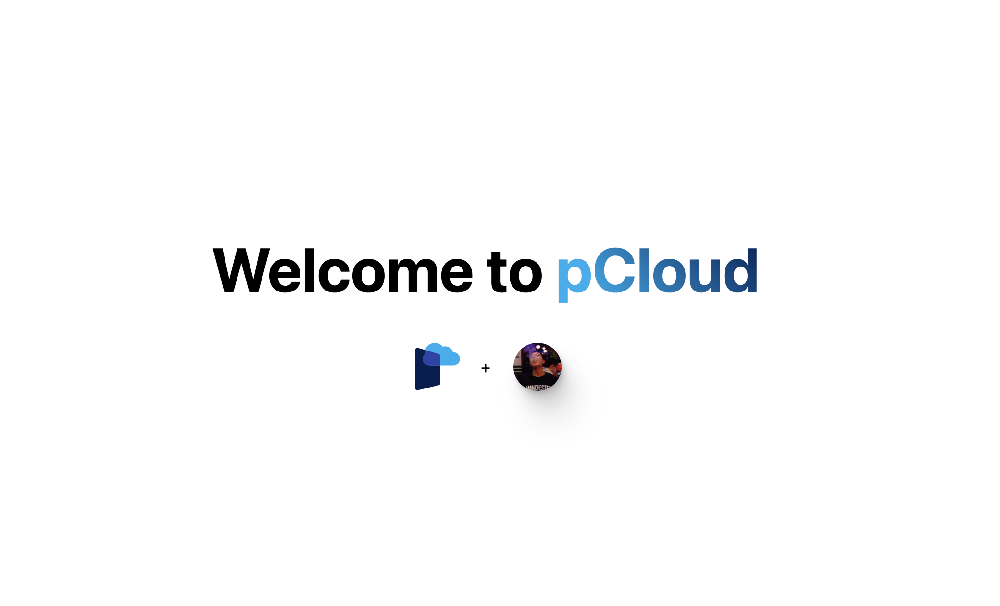

- [RFC: pCloud User flow](https://docs.google.com/document/d/1adgqQrHebADybfvWuWP-lF5dywtSPAaNBcpyeTXAq5w/edit#)

## basic info

- [Home Page](https://pcloud-fe.vercel.app/)
- [Deployment History](https://vercel.com/pcloud-fe/pcloud-fe/deployments)
- [API Logs](https://vercel.com/pcloud-fe/pcloud-fe/DLjxmfREGcDWfHs2d3qs9gSpVcPJ/functions?name=api%2Fdate.go)

frontend resrouces are built and delivered by Vercel.

APIs are severless functions deployed on AWS ap-east-1

using redis as data base, hosted by [upstash](https://console.upstash.com/redis/d67541bf-3904-488d-a612-6ecf5393891e), max 10K commands per day

Logo:     

## development

1. to add new APIs, create file under `./api` folder. for example, `./api/date.js` will be handling request to `https://pcloud-fe.vercel.app/api/date`; if need to use other languages (Go, Python and Ruby), see [pcloud-be](https://github.com/wanghaoPolar/pcloud-be/tree/main)
2. to deploy new changes, push the commit to `main` branch, the deployment will start automatically and finish in minutes
